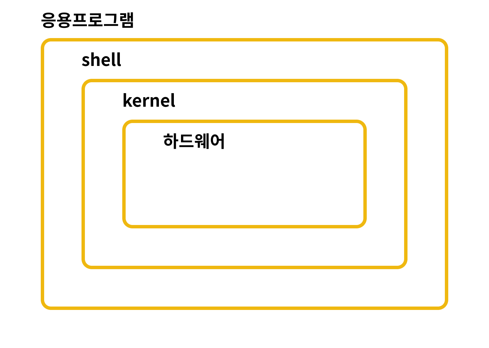
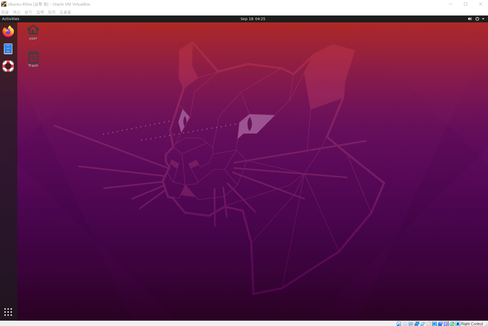
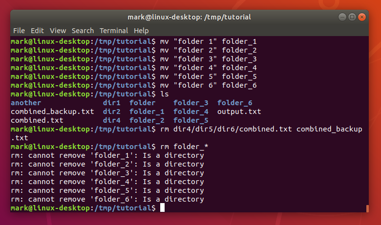
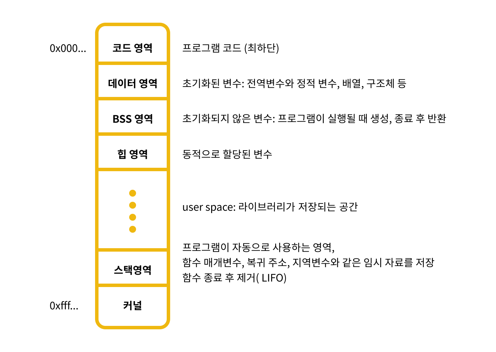

## 1. 리눅스(Linux)란?
<figure markdown="1">
  ")
  <figcaption>리눅스의 마스코트 턱스(Tux)</figcaption>
</figure>

리누즈 토발즈(Linus Torvalds)에 의해 만들어진 컴퓨터 운영체제로, 자유 소프트웨어와 오픈 소스 개발의 가장 유명한 표본이다. 
컴퓨터 역사상 가장 많은 참여자가 관여하고 있는 오픈소스로 누구나 개발에 참여하고 코드를 볼 수 있는 프로젝트이다. 
또한, 리눅스는 GNU 프로젝트의 일환이다. 
GNU 프로젝트란, **"GNU(그누) is not Unix(원래 문장 안에 자신이 이미 들어있는 재귀 약자)"**의 줄임말로, 리처드 스톨먼의 주도하에 시작된 공개 소프트웨어 프로젝트이다. 
유닉스 운영체제를 각자의 회사에서 개발하고 소스 코드를 공유하지 않는 문화에 대한 반발로 생겼다. 
자유 소프트웨어라는 철학을 가지고 있으며, 스톨만은 첫 선언문에 이은 GNU 선언문을 비롯한 여러 글들을 통해서 "초기 전산 공동체에 지배적이었던 협동 정신을 되돌리자"고 주장했다.


## 2. 리눅스 구조
<figure markdown="1">
  
</figure>

office 등의 문서편집기 혹은 웹브라우저와 같은 **응용프로그램**에서 사용자가 명령을 내리면 **shell(셸, 쉘)**은 이 명령을 해석해준다. 
그래서 shell을 명령어 해석기라고도 부르며, 해석된 사용자 입력 명령어를 **kernel(커널)**에게 전달한다. 
kernel은 **하드웨어**를 제어하는 코드를 통해 소프트웨어와 커뮤니케이션을 하며, 시스템의 모든 자원을 통제/관리하는 역할을 수행한다.


## 3. 리눅스의 특징/종류
리눅스는 유닉스(Unix)라는 운영체제를 기반으로 하고 있으며, 뛰어난 안정성과 보안성, 높은 신뢰성과 성능이 특징이다. 
시스템의 자원을 효율적으로 관리 및 사용할 수 있으며, 멀티 유저(multi-user)와 멀티 태스킹(multi-tasking)을 지원하고 있다.

  > Multi-User: 여러사용자가 동시에 하나의 시스템에 접근할 수 있음  
  > Multi-Tasking: 여러 개의 task(작업)를 동시에 실행하고, 교대로 컴퓨터의 자원을 사용할 수 있는 기능

또한, 대부분의 리눅스는 CLI(명령어창)와 GUI(그래픽)를 모두 지원하고 있으며, 다양하고 강력한 네트워킹 기능 덕분에 서버 OS로 적합하다. PC 서버에서도 엔터프라이즈 급의 성능을 제공하고, 성능이 낮은 PC에서도 작동한다. 앞서 언급한 것과 같이 오픈소스 프로젝트이기 때문에 커널 소스코드 및 모든 관련 자료가 공개되어 빠른 발전을 지원하고 있다. 다양한 업무 환경을 만족시키는 다양한 배포판이 존재하고 풍부한 응용프로그램을 제공하고 있다.
가장 유명하고 사용성이 좋은 우분투(Ubuntu)와 사용자 인터페이스가 잘 갖춰진 페도라(Fedora), 라즈베리파이에서 자주 쓰이는 라즈비안, 우리에게 친숙한 안드로이드까지 모두 리눅스의 한 종류입니다.

| 패키지 형식           | 패키지 관리자             | 운영체제                      |
| --------------------- | ------------------------- | ----------------------------- |
| 레드헷(.rmp)          | yum                       | CentOS, 페도라                |
| 데비안 레드헷(.deb)   | apt                       | 우분투, 리눅스 민트, 라즈비안 |
| 안드로이드(.apk)      | Android Package Manager   | 안드로이드 OS                 |

  > 활용분야: 라우터나 AP와 같은 곳에서 사용하는 네트워크 서버장비, 라즈베리파이와 같은 임베딩시스템과 IoT, TV 셋톱박스, 정밀 의료기기, 리눅스 개발 서버 등


## 4. 가장 높은 인지도의 리눅스: 우분투
<figure markdown="1">
  
</figure>

우분투는 리눅스 중에서도 가장 높은 인지도를 자랑한다. 데비안 GNU/Linux를 기반으로 제작된 데스크탑 환경을 사용하는 리눅스 배포판이다.

  > Ubuntu: 남아프리카의 반투어인 우분투라는 말에서 파생. 
  > 사람들간의 관계와 헌신에 중점을 둔 윤리사상 혹은 인본주의 사상으로 평화운동의 사상적 뿌리라는 철학을 가지고 있음. 
  > 마음이 열려 있고, 타인을 돕고 존중한다는 의미를 가지고 있음.

개인용 PC 환경에 최적화되어있고, 간결하고 쉽게 사용할 수 있다는 점이 큰 장점이다. 또한, 높은 인지도와 많은 사용자를 보유하고 있어 그에 따른 커뮤니티도 많다. 우분투를 사용하던 중 문제가 생기거나 질문이 있을 때, 커뮤니티를 통해 빠르게 해결할 수 있다. 약 6개월 단위로 업데이트되기 때문에 보안이슈, 버그에의 대응이 빠르다. GNOME(그놈)을 기반으로 한 인터페이스도 가지고 있다.

<figure markdown="1">
  
</figure>

  > 버전 번호 ex. 19.04 = 19년도 4월 공개 버전을 의미. LTS는 Long Term Support의 약어로, 장기간(약 5년)으로 우분투에서 지원해주는 가장 안정적인 버전을 의미.


## 5. GUI vs CLI
대부분의 리눅스가 GUI와 CLI를 지원하고 각각은 그래픽창과 명령창을 의미한다.

### 5-1. GUI: Graphical User Interface
<figure markdown="1">
  
</figure>

위 이미지 처럼 일반적인 사용자가 흔히 사용하는 인터페이스다.  
사용자가 편리하게 사용할 수 있도록 기능을 아이콘, 이미지 등의 그래픽으로 나타낸 인터페이스다.  
마우스 클릭이나 드래그앤드롭이 가능하고 수시로 확인이 가능하여 사용이 쉽다.  
흔히 사용하는 Windows와 Mac 운영체제 모두 지원하고 있다.

### 5-2. CLI: Command Line Interface
<figure markdown="1">
  
</figure>

문자로 사용자와 컴퓨터가 상호작용하여 동작하는 인터페이스다.  
Windows의 CMD, Mac의 Terminal에서 CLI를 사용할 수 있다.


## 6. 패키지 관리자 - apt
Advanced Packaging Tool의 약자로, 데비안 리눅스(.dev) 또는 파생된 배포판(우분투)에서 소프트웨어를 설치, 제거, 업데이트할 때 사용한다. 과거에는 설치, 제거, 업데이트에서 **`apt-get`**을, 검색과 확인에서는 **`apt-cache`**를 따로 사용했다. 하지만 최근에는 모두 apt로 통일되었다. 다만, 높은 권한이 필요한 활동에 대해서는 **`apt`** 앞에 **`sudo`**를 함께 입력하여 권한을 획득해야 한다.

### 6-1. sudo
패키지 설치와 같은 활동에서는 **`apt install ~~`**을 입력했을 때 **`permission denied`**라는 메시지와 함께 활동이 제한될 수 있다. 이 때, **`sudo`**를 입력함으로써 리눅스에서 모든 권한을 가지고 있는 최고 관리자 root의 권한을 획득할 수 있다. root는 운영체제의 모든 것을 제어할 권리를 가진다.
  
**`sudo apt install package`**
sudo와 함께 입력함으로써 관리자 권한을 획득하고, 암호를 입력하면 관리자 권한으로 패키지 설치가 가능하다.

### 6-2. 폴더별 권한
ls -al 명령어를 통해 모든 파일의 모든 속성을 확인할 수 있다. 파일의 속성은 다음과 같다.

**`- rw-r-r- 1 soryeongk elice 8980 9월 18일 11:52 soryeognk.txt`**

  * `-`: 파일 유형을 말하며, -은 파일을 d는 폴더를 의미
  * `rw-r-r-`: 파일의 권한
  * `1`: 링크된 수
  * `soryeongk`: 파일 소유자
  * `elice`: 소유 그룹
  * `8980`: 파일의 크기
  * `9월 18일 11:52`: 마지막 변경 시간
  * `soryeongk.txt`: 파일 이름

r(읽기, 4), w(쓰기, 2), x(실행, 1)로 구성되는데, 소유자/그룹/그외사용자 3개의 덩어리로 이루어진다. 예를 들어, **`rw-r--r--`**의 경우, 소유자는 읽기와 쓰기가 가능하고 그룹과 그외 사용자는 읽기만 가능하다는 뜻이다.

숫자로 작성하기도 하며, **`-`** 하이픈은 0으로 한다. 각 권한의 숫자를 더해서 나타내야 하므로 **`rw`** 읽기 쓰기 권한은 4+2인 6으로, **`rx`** 읽기 실행 권한은 4+1인 5로 나타낸다. 읽기 쓰기 실행의 권한 4+2+1인 7이 된다.

권한을 변경하고 싶을 때에는 이 숫자를 사용해 **`chmod [파일권한] [파일 위치 또는 이름]`**을 사용하면 된다. 가령 **소유자**는 **읽기 쓰기 실행**의 권한을, **그룹**은 **읽기 실행**만을, **그외 사용자**는 **실행**의 권한만을 가지게 한다고 하면 **`751`**를 입력하면 된다. **`777`**은 모든 사용자가 모든 권한을 얻는다는 의미다.

소유자를 변경할 때에는 **`chown [소유할유저]:[소유할 그룹] [파일 위치 또는 파일명]`**을 입력하면 되며 root 권한이 있어야 실행이 가능하다.


## 7. 리눅스 파일 시스템
파일이란, 주기억장치나 디스크처럼 하드웨어 저장공간에 저장되는 데이터의 집합을 말한다.

파일시스템이란, 저장 장치 내에서 데이터를 읽고 쓰기 위해 미리 정한 약속이다. 하드디스크와 ssd는 데이터가 저장된 위치가 이 약속에 따라 달라진다. 때문에 파일 저장 및 검색을 할 수 있도록 관리하는 방법도 파일시스템이라고 말한다. 파일을 어떻게 관리할 것인가에 대한 정책이라고 생각하면 된다.

대부분의 파일 시스템은 **`디렉토리`**와 **`파일`**의 형태로 구성되어 있다. 리눅스의 파일시스템은 root 파일 아래에 계층적으로 모든 파일과 디렉토리가 만들어진다.

### 7-1. 파일시스템의 종류
1. **FAT**: File Allocate Table
파일 할당 테이블이라고 말하며, 디지털 카메라 등에 장착되는 대부분의 메모리 카드와 수많은 컴퓨터 시스템에 널리 쓰이는 파일 시스템의 종류다. 하지만, 너무 단순한 자료구조 탓에 작은 파일이 여러개 있을 경우 공간 활용을 제대로 하지 못한다는 단점이 있다. 용량이 계속 커지고 있으며, 높은 호환성을 갖는다.

2. **NTFS**: New Technology File System
Windows NT 계열의 새로운 파일 시스템으로 기존의 FAT 구조를 대체하기위해 만들어졌다. 시스템 고장 및 손상 시, 디스크 볼륨을 재구성하여 일관성있는 상태로 복구가 가능하여 안정성이 높고, 보안성도 FAT보다 향상된 파일 시스템이다.

3. **EXT**: EXTended file system
확장 파일 시스템의 준말로 리눅스의 기본 파일 시스템이다. 성능을 향상시키면서 시리즈로 출시되고 있는데, 기본으로 사용되던 2차 확장 파일 시스템 EXT2를 완벽하게 호환하는 EXT3와 EXT4가 있다. EXT3부터 큰 규모의 디렉토리를 접근하기 위해 해쉬를 통해 접근하는 H-tree를 사용하여 데이터 검색이 보다 용이해졌고, EXT4는 지금까지 중 가장 큰 초대형 파일 시스템이다.

### 7-2. 리눅스의 디렉토리의 구조
모든 디렉토리는 최상위 디렉토리인 root이 하위로 만들어진다.

  * bin: 기본 명령어들이 저장된 폴더
  * boot: 리눅스의 boot(시작)와 관련한 명령이 들어간 폴더
  * etc: 리눅스의 거의 모든 설정 파일이 들어간 폴더
  * home: 말그대로 홈 폴더, 로그인한 계정에 따라 폴더가 만들어짐
  * lib: 리눅스 및 각종 프로그램에서 사용되는 라이브러리들의 폴더

    ```bash
    root
    ├── bin
    ├── home
    │   └── 99percent
    │   │   └── Desktop
    │   │   └── 폴더
    │   │   └── index.html
    ├── lib
    ├── user
    ├── boot
    └── etc
    ``` 


## 8. 리눅스 명령어
  * head, tail: 각각 처음과 끝의 N줄을 출력해주는 명령어로 cat과 함께 자주 쓰임
    ``` bash
    $ cat [filename] | head -n[N] cat [filename] | tail -n[N]
    ```
  * alias: 지정 명령어
  * su: 현재 사용자 변경하는 명령어
    ``` bash
    $ su [계정명, 없으면 root로]를 입력하고 비밀번호 입력
    ```
  * more: cat과 달리 화면 단위로 출력하며, 스페이스바로 한 칸씩 내리면서 내용 확인 가능
    ``` bash
    $ more [filename]
    ```
  * which: 절대 경로를 알려주는 것으로 명령어의 위치도 알 수 있음
    ``` bash
    $ which cat
    ```
  * wc: 파일의 바이트, 문자, 단어, 라인 수를 출력해주는 명령어
    ``` bash
    $ wc [option] [filname]
    ```
  * shutdown: 시스템 종료 및 재부팅 명령어
    ``` bash
    $ shutdown -r now     # 즉시 재부팅
    $ shutdown -h now     # 즉시 종료
    ```
  * diff: 두 파일 간의 차이를 보여주는 명령어
    ``` bash
    $ diff [filename1] [filename2] - filename1과 filename2의 차이를 보여준다.
    ```

### 8-1. File Redirection
표준 스트림의 흐름을 바꾸어 일반적인 표준 스트림(표준 입력 및 출력 그리고 오류)를 사용하지 않고 다른 경로인 파일로 재지정하는 것을 뜻한다. **`<`**과 **`>`**을 이용하여 사용 가능하다.

  > 표준 스트림  
  > **stdin**: 표준입력-키보드 입력  
  > **stdout**: 표준 출력-화면 출력(`cat`, `ls`)  
  > **stderr**: 표준 오류 출력

**`ls > exitedFilename.txt`** 을 입력하면, **`ls`**명령 수행의 결과를 콘솔에 찍어주는 것 대신, **`exitedFilename.txt`**에 저장한다. 기존의 내용을 대체하므로 주의해야한다.
만약 존재하는 파일이 없는 경우에는 **`>`**대신 **`>>`**을 사용하여 **`ls >> newFilename.txt`**처럼 입력하면 된다. 만약 **`newFilename.txt`**가 이미 존재하는 파일이라면 기존의 내용은 지우지 않고, 마지막 줄에 이어서 작성한다.

python 파일을 작성하고, 입력 값을 다른 파일에 저장해둔 경우에도 file redirection을 사용할 수 있다.
예를 들어, 다음과 같은 파일들이 같은 폴더 내에 있다고 가정하겠다.

  ``` py title="add_3.py"
  input_num = input()
  answer = int(input_num) + 3
  print(answer)
  ```

  ``` title="input_num.txt"
  10
  ```

  ``` title="result.txt"
  The result is
  ```

**`input_num.txt`**의 내용 10을 add_3.py의 입력으로 넣은 뒤, 그 결과를 **`result.txt`**의 내용을 지우지 않고 뒤 이어서 담는 명령어의 수행 순서는 다음과 같다.

1. 코드 실행을 위한 인터프리터 호출한다. - **`python [python filename]`**
2. **`<`**으로 오른쪽의 내용을 왼쪽의 입력값으로 지정한다.
3. 그 결과를 이미 존재하는 **`result.txt`**의 내용에 뒤이어 작성한다.

정답: **`python add_3.py < input_num.txt >> result.txt`**

  > 해석: 코드 실행을 위한 인터프리터 호출을 위해 **`python [python filename]`**을 입력하고, **`<`**으로 오른쪽의 내용을 왼쪽의 입력값으로 지정한다. 그리고 그 결과를 이미 존재하는 **`result.txt`**의 내용에 뒤이어 작성하기 위해 **`>>`**를 사용한다.

### 8-2. piping command
file redirection과 유사한 pipe는 **`|`**로 명령을 구분한다. 여러가지 복잡한 명령어를 병렬로 작성할 수 있다.
가령, 이상에서 file redirection으로 작성한 **`python add_3.py < input_num.txt >> result.txt`**의 내용을 piping command로도 똑같이 수행할 수 있다. 수행의 과정은 다음과 같다.

1. **`input_num.txt`**의 내용을 출력한다.
2. 출력된 내용과 함께 **`add_3.py`**를 실행한다.
3. 그 내용을 **`result.txt`**에 작성한다. - file redirection 사용

정답: **`cat input_num.txt | python add_3.py >> result.txt`**


## 9. 리눅스의 메모장, nano editor
UNIX 호환 시스템에서 사용 가능한 가볍고 간단한 텍스트 에디터로, 손쉽게 파일 내용 수정이 가능하다.

| 단축키    |	기능  |	단축키    |	기능          |
| --------- | ----- | --------- | ------------- |
| ctrl + o  |	저장  |	Alt + 6   |	복사          |
| ctrl + x  |	종료  |	ctrl + u  |	붙여넣기      |
| ctrl + w  |	검색  |	ctrl + ^  |	여러 줄 선택  |


## 10. mount
물리적인 저장장치(보조기억장치)를 디렉토리(폴더)에 연결시켜주는 것을 말한다. windows에서는 하드, USB 등의 보조기억장치를 연결하면 자동으로 디렉토리(폴더)에 연결된다. USB를 꽂자마자 사용할 수 있게 되며, 이것을 Plug and Play 즉, PnP라고 한다.

하지만 **리눅스의 경우 PnP 기능이 작동하지 않는다.** 직접 연결을 위해 보조기억장치를 설치했을 때 mount 작업을 수행해야 한다.

명령어 기본형태: **`mount [option] [device] [directory]`**

  * `device`의 내용을 `directory`에 연결해준다.
  * device의 파일 시스템 명을 알아야하는데, 파일 시스템 명은 fdisk -l로 확인할 수 있다.

OPTIONS

  * **`-a`**: etc/fstab에 명시된 파일 시스템을 마운트할 때 사용
  * **`-t`**: etx/fstab가 아닌 파일 시스템의 유형을 지정할 때 사용
  * **`-o`**: 추가적인 설정을 적요할 때 사용되며, 다수 조건을 적용할 때는 `,`로 구분

  ``` bash
  $ df                              # mount된 디스크 정보 출력
  $ remount [device] [directory]    # mount 해제
  ```


## 11. 리눅스 프로세스
프로세스란, 시스템에서 메모리에 적재되어 실행되고 있는 모든 프로그램을 말한다.

프로그램은 코딩을 통해 만든 코딩(명령어)의 집합체이고, 프로세스는 프로그램이 실행되는 과정 중에 현 상황을 말한다. 즉, 실행되고 있는 프로그램이 곧 프로세스이며, RAM에 저장된다. 한 프로그램 내에서 여러 프로세스가 생성된다면 이를 멀티 프로세싱이라고 말한다. 이들은 모두 운영체제에 의해 관리된다.

### 11-1. 프로세스의 특징
1. 모든 프로그램은 실행될 때 **하나 이상의 프로세스**를 갖는다.
2. **병행**적으로 실행이 가능하다.
3. **부모(PPID), 자식**(fork를 통해 복사된 것) 프로세스가 있게 된다.
4. **커널(kernel)**에 의해 관리된다.
5. 모든 프로세스에는 **소유자(리눅스 계정)**가 있다.
6. 프로세스마다 **식별을 위한 ID(PID)**가 부여된다.

  > PID:
  > 모든 프로세스는 **고유한 PID**를 가지고 있으며, 1번은 `init 프로세스`, 2번은 `kthreadd(kernel thread demon) 프로세스`가 실행된다.  
  > `init 프로세스`는 나머지 모든 시스템 프로세스의 **부모 프로세스**로, `kthreadd`가 아닌 다른 모든 프로세스들은 모두 `init 프로세스`를 **fork하여 생성된 것**이다. 또한, `kthreadd`는 **이 후에 실행되는 모든 프로세스의 부모 프로세스**다.

### 11-2. RAM(메모리) 구성
<figure markdown="1">
  
</figure>

프로세스 메모리는 크게 커널 주소 공간(kernel space)와 사용자 주소 공간으로 분리할 수 있으며, 이때 kernel 부분은 사용자가 접근할 수 없다. 우리가 사용하는 공간은 stack, heap, data, text 4개의 영역으로 나뉘는데, `argv`, `argc`, `env`, `etc` 파일들 역시 stack의 일부다.

### 11-3. 관련 명령어
1. 프로세스 목록 보기  
**`$ ps [option]`**  
  `-e`: 현재 실행중인 모든 프로세스 정보 출력  
  `-f`: 모든 정보 확인  
  `-a`: 실행중인 전체 사용자의 모든 프로세스 출력  
  `-u`: 프로세스를 실행한 사용자와 프로세스 시작 시간 등을 추력  
  `-x`: 터미널 제어 없이 프로세스 현황 보기  
조합하여 사용하는 것도 가능  

2. 프로세스 종료  
**`$ kill [option] [PID]`**  
  `-l`: 사용 가능한 시그널 목록을 출력  
  `-1`: 재실행(SIGHUP)  
  `-9`: 강제종료(SIGKILL)  
  `-15`: 정상종료(SIGTERM)


## 12. job
리눅스에서 터미널을 통해 작동하는 거의 모든 명령어는 foreground에서 작동한다. 즉, 우리가 지금 보고 있는 화면에서 그대로 작동한다는 것이다. 하지만, `&`명령을 통해 background를 사용하여 보이지 않는 곳에서도 돌아가게 할 수 있다.

job은 그 백그라운드로 실행되는 작업을 보여주고 효율적으로 사용할 수 있게 해주는 명령어다. job은 프로세스와 달리 터미널 명령을 통한 작업만을 의미하며, 각 터미널마다 job은 따로 존재한다. 즉, 터미널이 종료되면 job도 함께 종료되는 **의존적 형태**다.

명령어 뒤에 `&`를 붙이면 백그라운드에서 실행이 되는데, 이때의 목록은 `jobs`를 통해 확인할 수 있다. 프로세스와 마찬가지로 `ps` 명령어로 해당 프로세스의 `PID`를 알아내어 종료하는 것도 가능하고, 옵션 없이 `kill %[job 번호]`를 통해서도 종료가 가능하다.

예를 들어, 잠시 멈춤을 의미하는 sleep 명령어를 백그라운드에서 실행하고 종료하는 과정은 다음과 같다.

  ``` bash
  $ sleep 500 &
  $ sleep 700 &
  $ jobs
  ```

이때의 결과 화면은 다음과 같다.

  ``` bash
  [1] - 실행중 sleep 500 &
  [2] + 실행중 sleep 700 &
  ```

이때 `sleep 500 &` 종료할 때는 `kill %1`을 입력하면 된다.


## 13. 작업 예약

### 13-1. at
지정된 시간에 1회 실행되는 작업 예약 명령어로 시간이 되면 수행되고 작업 리스트에서 사라진다.

  ``` bash
  $ at [option] [time] [date] [+증가시간]
  ```

  * `-m`: 출력 결과와 함께 작업이 완료될 때 사용자에게 메일을 보냄(결과가 없더라도 메일을 보냄)
  * `-f`: 특정 스크립트 파일 등을 실행할 때 사용
  `at now + 3 hours -f test.sh`은 지금으로부터 3시간 뒤 `test.sh`를 실행하라는 의미
  * `-l`: 예약된 작업 목록을 출력하며, `atq` 명령어와 같은 동작을 수행
  * `-v`: 작업이 수행될 정확한 시간을 출력
  * `-d`: 예약된 작업을 삭제하며, `atrm` 명령어롸 같은 동작을 수행

### 13-2. crontab
crontab은 at과는 달리 주기적으로 예약을 실행할 수 있다.

  ``` bash
  $ crontab [option] [option에 맞는 text]
  ```

  * `-l`: 현재 계정의 설정된 crontab 정보를 보여줌
  * `-e`: 현재 계정의 crontab 정보를 수정
  * `-r`: 현재 계정의 crontab 정보를 모두 삭제
  * `-u`: 특정 사용자의 crontab 정보를 다루게 해주며 root 권한 필요해 `sudo`와 함께 사용


## 14. SSH
Secure SHell의 준말로 네트워크를 통해 다른 컴퓨터에 접근하거나 그 컴퓨터에서 명령을 실행할 수 있도록 해주는 프로토콜이다. 즉, SSH를 통해 다른 컴퓨터에서 리눅스에 접속하여 명령어 및 프로그램을 실행할 수 있다.

  > Telnet: SSH 이전에 다른 컴퓨터에 접근하거나 명령을 실행하는 등을 할 수 있도록 해주는 프로토콜이었으나, 보안적으로 매우 치명적인 결함이 존재.  
  > 패킷 데이터가 암호화되어있지 않아서 도중에 탈취될 경우 비밀번호 등의 민감정보가 노출되는.. 치명적인..! 때문에 SSH에는 데이터가 암호화되어 있음.

우분투에서는 openssh라는 패키지를 통해 SSH를 구동할 수 있는데, 우분투 설치 후에는 기본적으로 openssh-client만이 설치되어 있다. 다른 컴퓨터에서 우분투에 접속하려면 openssh-server 패키지를 설치해야 한다.

  > `dpkg -l | grep openssh` 명령어를 통해 openssh 설치 여부 확인이 가능하다.  
  > 또한, `sudo apt-get install open-ssh-server`를 통해 설치가 가능함.

### 14-1. ssh 서버 실행
  ``` bash
  $ sudo service ssh start
  $ service --status-all | grep +
  ```

종료 시에는 `start` 대신 `stop`을, 재시작에는 `restart`을 입력하면 된다.
이상의 명령어를 차례로 입력하면 리스팅이 되는데, ssh만 보고 싶은 경우에는 `service --status-all | grep ssh`를 입력하면 된다.

### 14-2. ssh 포트 확인하기
ssh를 사용하기 위해서는 다른 컴퓨터에서 해당 컴퓨터에 어떤 포트로 접속할지를 알아야 한다. 이를 위해 `sudo netstat -antp` 명령어를 통해 실행하고 있는 ssh의 포트를 확인할 수 있다. `PID`와 함께 현재 실행중인 프로세스들과 포트를 확인할 수 있다.

### 14-3. ssh 포트 접속하기
`ssh [서버 아이디] @[IP || 서버이름 || 도메인`을 입력하면 해당 서버로의 접속이 가능하다.